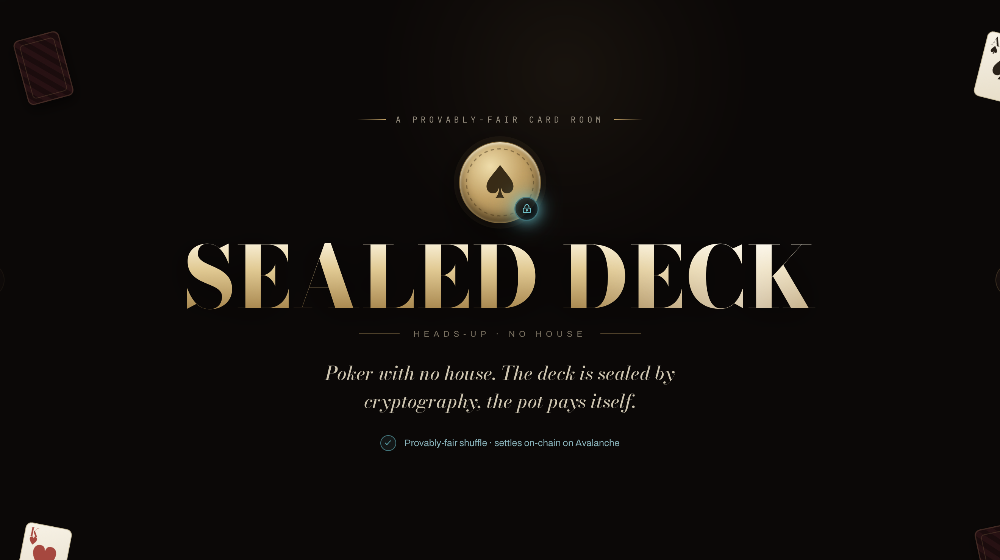
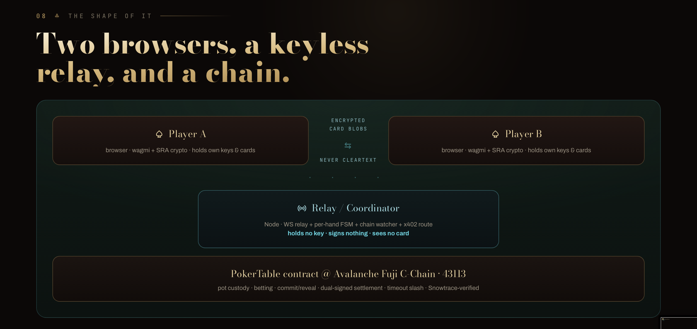
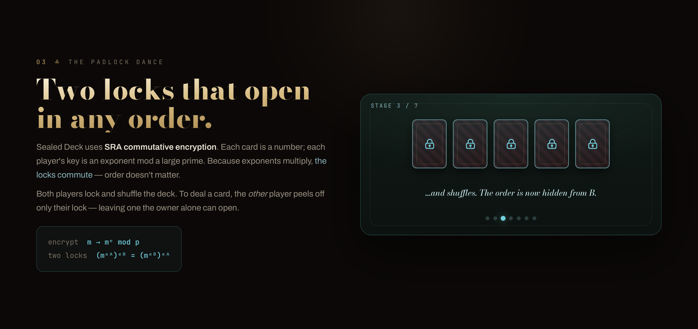
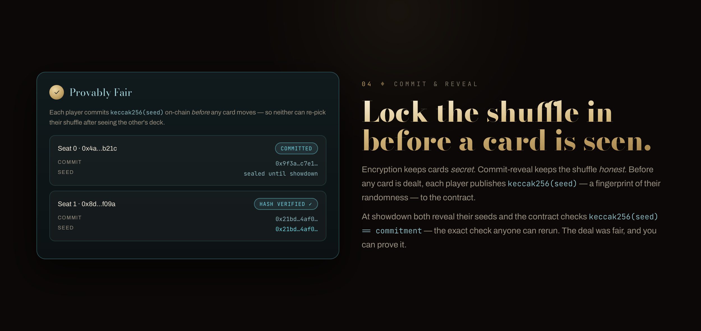
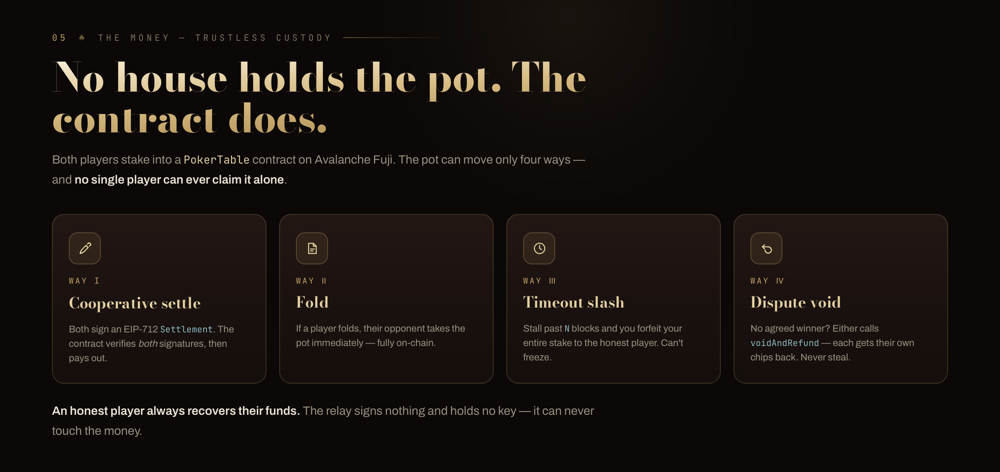

# Sealed Deck

Trustless heads-up poker on Avalanche Fuji. Two players collaboratively shuffle and encrypt the deck using SRA commutative encryption — neither player nor the relay server ever sees card order. Pot custody and settlement are fully on-chain.

Built for an Avalanche hackathon. Fuji C-Chain (`43113`). One hand per contract instance.

<p align="center">
  
</p>

<p align="center"><em>An interactive walkthrough of the design ships in <a href="explainer.html"><code>explainer.html</code></a>.</em></p>

---

## Architecture

<p align="center">
  
</p>

- **Contracts** (`contracts/`) — `PokerTable.sol` (AVAX) and `PokerTableUSDC.sol` (x402 USDC buy-in): on-chain escrow, betting accounting, commit/reveal, dual-signed settlement, timeout/slash
- **Crypto** (`packages/mental-poker/`) — SRA commutative encryption for card secrecy, seeded shuffle with commit-reveal for shuffle fairness. Runs client-side; server never sees a private card
- **Server** (`server/`) — WebSocket relay + per-hand FSM + Fuji chain watcher + x402 buy-in middleware. Holds no keys, signs nothing
- **Frontend** (`frontend/`) — React/Vite, wagmi/viem

---

## Provably fair

Two mechanisms keep the game honest with no trusted dealer:

- **SRA commutative encryption — the "padlock dance."** Each card is a number locked with a player's secret key; the locks *commute*, so both players lock and shuffle the deck, then peel a single lock to deal a card only its owner can read.
- **Commit–reveal.** Before any card moves, each player publishes `keccak256(seed)` on-chain; at showdown the seeds are revealed and verified — so nobody could have re-picked their shuffle after seeing the other's.

<p align="center">
  
  
</p>

---

## Settlement model

The pot moves four ways only — no player can claim unilaterally:

| # | How | Result |
|---|-----|--------|
| 1 | **Cooperative settle** — both sign an EIP-712 `Settlement` struct | `settleHand` verifies both sigs, pays winner |
| 2 | **Fold** | Opponent takes pot immediately |
| 3 | **Timeout/slash** — non-acting player stalls past `TIMEOUT_BLOCKS` | Staller forfeits entire stake to honest player |
| 4 | **Void** — both reveal but never agree on a winner | `voidAndRefund` returns each player's own contribution |

A griefer can force a void but can never steal the opponent's funds.

<p align="center">
  
</p>

---

## Quickstart

**Prerequisites:** Node ≥ 20 · Foundry (`curl -L https://foundry.paradigm.xyz | bash && foundryup`) · MetaMask on Fuji

```bash
git clone <repo> && cd Sealed-deck
cp .env.example .env
# fill in: PRIVATE_KEY (throwaway deployer), FUJI_RPC_URL
npm install
```

### Run tests

```bash
cd contracts && forge test -vv   # 26 tests (21 AVAX + 5 USDC/x402)
npm run test:crypto               # 13 Vitest (SRA crypto)
```

### Deploy to Fuji

```bash
cd contracts
set -a; source ../.env; set +a
forge script script/Deploy.s.sol:Deploy \
  --rpc-url "$FUJI_RPC_URL" --broadcast \
  --verify --verifier-url "https://api.routescan.io/v2/network/testnet/evm/43113/etherscan" \
  --etherscan-api-key "verifyContract"
```

Copy the printed address into:
- `.env` → `POKER_TABLE_ADDRESS`
- `frontend/.env` → `VITE_POKER_TABLE_ADDRESS`

### Run locally

```bash
cp frontend/.env.example frontend/.env
# set VITE_POKER_TABLE_ADDRESS and VITE_PUBLIC_SERVER_URL=http://localhost:8787

npm run dev:server    # relay on :8787
npm run dev:web       # frontend on :5173
```

### Docker (one command)

```bash
docker compose up --build
# relay → :8787   frontend → :5173
```

For a VPN/remote demo: set `VITE_PUBLIC_SERVER_URL=http://<HOST_IP>:8787` in `frontend/.env` before building, then share `http://<HOST_IP>:5173` with the second player.

---

## x402 USDC buy-in

The default table uses native AVAX (`BETTING_PATH=avax`). Switch to `BETTING_PATH=x402-usdc` to use Avalanche native Circle USDC (`0x5425890298aed601595a70AB815c96711a31Bc65`) via EIP-3009 `transferWithAuthorization`. The buy-in is signed off-chain as an `X-PAYMENT` header; `PokerTableUSDC.joinWithAuthorization(...)` settles it on-chain. Get test USDC from the [Circle faucet](https://faucet.circle.com).

---

## Layout

```
contracts/
  src/          PokerTable.sol · PokerTableUSDC.sol · MockUSDC.sol
  test/         Foundry tests
  script/       Deploy.s.sol · DeployUSDC.s.sol
packages/
  mental-poker/ SRA crypto + padlock protocol + pokersolver hand eval
  contracts-abi/ shared ABIs (server + frontend)
server/         Express + WS relay + x402 middleware
frontend/       React/Vite UI
```

---

